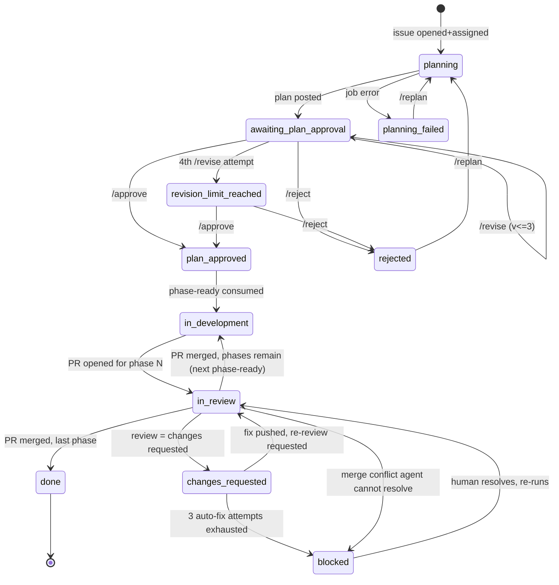

# Autonomous SDLC Automation — Design Spec

Status: proposed / initial implementation. Repo: `farooqngp/edu-eco`. Integration branch: `dev`.

## 1. Goal

Fully autonomous issue → plan → approval → implementation → PR → merge cycle, gated only by
two human decision points: **plan approval** and **PR approval**. Everything else (planning,
branching, coding, PR creation, conflict resolution, phase sequencing) is agent-driven.

## 2. Actors

- **Agent**: `anthropics/claude-code-action@v1`, invoked per-job with a task-specific prompt.
- **Assignee**: the developer assigned to the issue. The only person (besides users with
  `write`/`maintain`/`admin` repo permission) authorized to drive state transitions.
- **Bot identity**: a dedicated GitHub App (preferred) or bot-account PAT, stored as
  `secrets.SDLC_BOT_TOKEN`. See §7 — this is required, not optional.

## 3. State machine (issue labels)

All labels are prefixed `sdlc:`. Exactly one "phase" label from the first group is active at
a time; the others are independent markers.

```
sdlc:planning              -> agent is drafting/redrafting a plan
sdlc:planning-failed       -> planning job errored; /replan re-enters here
sdlc:awaiting-plan-approval-> plan posted, waiting on assignee
sdlc:rejected              -> assignee rejected the plan (terminal until /replan)
sdlc:revision-limit-reached-> 3 revisions used; assignee must /approve or /reject
sdlc:plan-approved         -> permanent marker: this issue's plan was locked for build
sdlc:phase-ready           -> ephemeral trigger label; consumed immediately by sdlc-03
sdlc:in-development        -> at least one phase branch/PR is active
sdlc:in-review             -> current phase PR open, awaiting human review
sdlc:changes-requested     -> reviewer requested changes; agent is auto-addressing
sdlc:blocked               -> automation stopped; needs human (conflict/fix-attempt cap hit)
sdlc:done                  -> all phases merged, issue closed
```

Mermaid state diagram:



## 4. Machine-readable metadata (not labels)

Labels are for humans; **derived facts come from GitHub objects themselves**, not counter
labels, so state can't drift:

- **Plan version / revision count** = number of prior `## 📋 Development Plan` comments
  the bot has posted on the issue. v1 = revision 0. Revision cap (3) = block `/revise`
  once 3 prior plans exist (i.e. v4 is the last allowed revision output).
- **Phase count** = parsed from an HTML marker the planning prompt is required to emit at
  the top of the locked plan comment: `<!-- sdlc-plan phases=P -->`.
- **Current phase number** = count of merged PRs whose branch matches
  `feature/{issue}-*` for this issue, +1.

This makes every workflow idempotent and re-runnable: nothing depends on run-to-run
in-memory state, only on what's actually in the issue/PR history.

## 5. Slash commands (issue comments only, deterministic — never LLM-classified)

| Command | Valid when | Effect |
|---|---|---|
| `/replan` | label ∈ {none, `planning-failed`, `rejected`} | fresh plan, v1 semantics reset (new thread) |
| `/approve` | label == `awaiting-plan-approval` (or `revision-limit-reached`) | lock plan, start phase 1 |
| `/reject <reason>` | label == `awaiting-plan-approval` (or `revision-limit-reached`) | terminal-ish, reason required |
| `/revise <feedback>` | label == `awaiting-plan-approval`, revisions < 3 | regenerate plan incorporating feedback / answering agent's questions |

Commands are parsed with a fixed regex in `.github/scripts/parse-command.sh` — the agent
never decides *which* transition happened, only generates content for the transition
already decided by bash. This is deliberate: intent classification on free text is where
this class of automation gets flaky.

Authorization: `.github/scripts/check-permission.sh` requires the commenter to be the
issue's assignee OR to hold `write`/`maintain`/`admin` on the repo. Unauthorized command
comments get a 👀 reaction and are otherwise ignored (not treated as an error).

## 6. Workflow files

| File | Trigger | Job |
|---|---|---|
| `sdlc-00-setup-labels.yml` | `workflow_dispatch`, push touching itself | idempotently create the label taxonomy |
| `sdlc-01-plan.yml` | `issues: assigned`, `issues: labeled` (`sdlc:planning-failed` via `/replan`) | draft plan, post comment, tag assignee |
| `sdlc-02-plan-command.yml` | `issue_comment: created` | parse command, gate, act (revise/approve/reject/replan) |
| `sdlc-03-develop-phase.yml` | `issues: labeled` (`sdlc:phase-ready`) | branch, implement one phase per plan, open PR |
| `sdlc-04-pr-feedback.yml` | `pull_request_review: submitted` (changes_requested) | auto-address review, bounded to 3 attempts |
| `sdlc-05-merge.yml` | `pull_request_review: submitted` (approved) + checks green | merge, resolve conflicts, advance phase or close issue |

Every workflow sets `concurrency: group: sdlc-${{ <issue number> }}, cancel-in-progress: false`
(issue number resolved from the PR's head branch for 04/05) so overlapping comments/events
on the same issue queue instead of racing.

## 7. Required setup (prerequisites — not automatable by the agent itself)

1. **A dedicated GitHub App**, installed on this repo only, with repository permissions
   Contents: Read & write, Issues: Read & write, Pull requests: Read & write. Its App ID and
   private key are stored as `secrets.SDLC_APP_ID` / `secrets.SDLC_APP_PRIVATE_KEY`. Every
   job exchanges these for a short-lived installation token via `.github/actions/app-token`
   (wrapping `actions/create-github-app-token`) instead of using a static PAT. **Required,
   not cosmetic**: GitHub does not fire subsequent workflow runs for events created by the
   default `GITHUB_TOKEN` (anti-recursion protection). Every label-add and PR-create that
   needs to trigger the *next* workflow in this pipeline (approve→develop, merge→next phase)
   uses this app's token — a personal PAT would work too, but the app avoids tying the
   pipeline's identity to one person's account and its tokens auto-expire (~1hr) rather than
   sitting as a long-lived static secret.
2. **`secrets.ANTHROPIC_API_KEY`** for the Claude Code action.
3. Branch protection on `dev`: require PR review + status checks, so `sdlc-05` merges only
   go through when a real human approval exists (defense in depth beyond the workflow gate).
4. `CLAUDE.md` at repo root (scaffolded — see below) — the planning and coding prompts
   both key off it; keep it current as the codebase grows.
5. **An independent CI workflow that produces PR status checks on `dev`** (build/test/lint,
   triggered on `pull_request`). `sdlc-05-merge.yml`'s "wait for required status checks"
   step reads `statusCheckRollup` — with no CI wired up yet, that check is a no-op (empty
   rollup ⇒ treated as passing) and the only quality gate is the implementation agent's own
   self-reported test run in `implement-phase.md`. That self-report is not an independent
   gate. Add real CI as soon as there's a stack to write it for.

## 8. Failure handling

- Planning job throws → `sdlc:planning-failed`, comment with error summary, `/replan` re-enters.
- Revision cap hit → `sdlc:revision-limit-reached`, forces `/approve` or `/reject`.
- Merge conflict the agent can't safely resolve → `sdlc:blocked`, tags assignee + repo admins,
  automation halts for that issue until a human pushes a fix and re-triggers.
- PR review fix-loop exceeds 3 attempts → `sdlc:blocked`, same halt/handoff behavior.

## 9. Open items for the user

- Confirm merge strategy (squash vs merge commit) for `sdlc-05` — defaulted to squash.
- Confirm who besides the assignee should count as "authorized" (currently: assignee OR
  repo write+).
- `SDLC_BOT_TOKEN` must be created and added as a repo secret before any of this runs.
